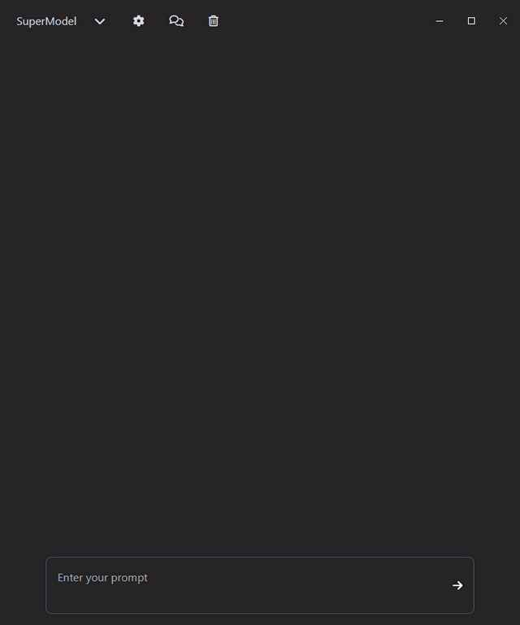

# *`__SuperModels`*

SuperModels is an open-source project for running LLM agents in a user-friendly desktop app.



Give it a try! [Download the executable here!](https://storage.googleapis.com/supermodels/SuperModels-1.0.0%20Setup.zip)

## *purpose*: 

`A self-reflecting machine:` 

- Think Wittgenstein not Frankenstein
- Built-in reflection mechanism to steer *thinking*
- Fully customisable

*__in short*
`A lightweight, simple, and easy to adapt Agent.`

Stack: `Python`, `Electronjs`, and `TailwindCSS`.

---

## *walk-through:*

#### 1. SuperModel
- I implemented a series of powerful LLM APIs for you to play with.
- Most notably, [Groq](https://groq.com/) which is faster than any other LLM. 

#### 2. ToolUser
The tools are basic but performant:
- The `python_wizzard` generates and executes Python on your system. 
  *Note that running generated code is not without risk. - Be prepared for SuperModels to take control over your OS and start operating your home automation.*
- A second tool, `online_llm` uses Perplexity AI under the hood for natural language web results. 

#### 3. Agent
The **real magic** happens [here](https://github.com/JohannesVC/supermodels/tree/master/python/dispatch/_agent) (click for source code): 

1. This is where the agent breaks down complex problems into steps:
```python
break_down = BreakdownReflection(prompt)
```
2. Every step is then passed to the *tooluser*:
```python
for step in break_down.steps:
    answer = tooluser.call(step)
```
3. The agent reflects on the result:
```python
work_harder = YesNoReflection(new_prompt, answer, model=self._model)
```

In short: `The combination of a super fast tooluser and nominally typed answers allows for quite impressive reflections and reasoning.` Although I still haven't got it to turn the lights off.

---

## *instructions*

Give it a try! [Download the executable here!](https://drive.google.com/file/d/1-Gxk9jkKhGLpx7jq6kFIVsU9OTPjgDfv/view?usp=sharing) (Note that you may get malware warnings.)

Then:

- Join the FREE beta at [groq.com](https://groq.com/) to get a free API KEY 
- Input the API key when the app prompts you
